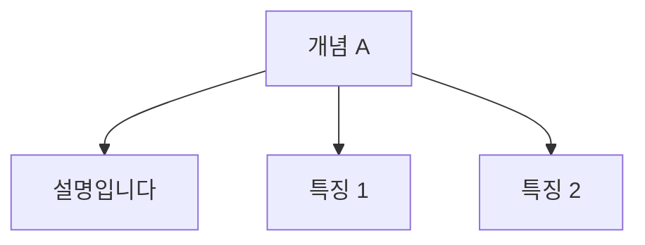
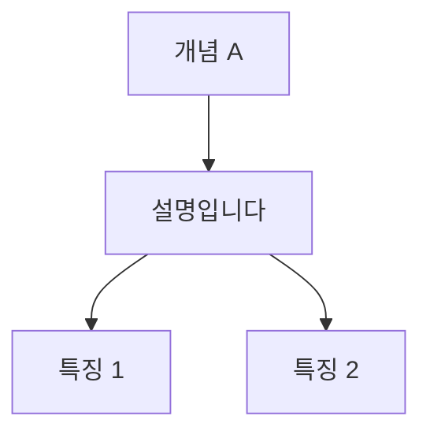

# 작업 완료 보고서: 일반 텍스트-리스트 계층화 기능

## 1. 개요
*   **작업명**: 일반 텍스트의 부모 노드 승격 (Paragraph-List Adjacency) 구현
*   **작업 일시**: 2026년 1월 6일
*   **작업 목표**: 마크다운 작성 시, 문단(Paragraph) 바로 뒤에 리스트(List)가 올 경우 이를 '형제'가 아닌 '부모-자식' 관계로 시각화하여 학습 노트의 계층 구조를 명확히 함.

## 2. 변경 내용
*   **파일**: `src/features/mdx-whiteboard/lib/parser.ts`
*   **주요 변경 사항**:
    1.  **`traverse` 함수 리팩토링**: 노드 생성 시 해당 노드의 ID를 반환하도록 수정하여, 호출자가 방금 생성된 노드의 정보를 알 수 있게 함.
    2.  **`processChildren` 헬퍼 함수 추가**: 자식 노드들을 순회할 때 `siblingParagraphId` 상태를 유지하도록 로직 구현.
    3.  **인접 규칙 적용**:
        *   현재 노드가 `List`이고, 직전 형제 노드가 `Paragraph`인 경우 → `Paragraph`를 부모로 설정.
        *   그 외의 경우 → 기존대로 상위 컨테이너(Section 등)를 부모로 설정.
    4.  **Root 레벨 순회 로직 개선**: 문서 최상위 레벨에서도 동일한 인접 규칙이 적용되도록 루프 로직 수정.

## 3. 결과 (Before & After)

**Input MDX:**
```markdown
# 개념 A
설명입니다.
- 특징 1
- 특징 2
```

**AS-IS (기존):**

*(설명과 특징이 동등한 레벨로 보여, 관계가 불명확함)*

**TO-BE (변경 후):**

*(특징이 설명의 하위 개념으로 시각화되어 학습 구조 파악 용이)*

## 4. 향후 고려사항
*   **다중 문단**: 문단이 여러 개 연속될 경우, 마지막 문단에만 리스트가 붙습니다. 이는 일반적인 문서 작성 관례(설명 직후 예시 나열)와 일치하므로 의도된 동작입니다.
*   **중첩 리스트**: 리스트 내부의 리스트는 기존 MDX 파싱 규칙에 따라 `ListItem`의 자식으로 정상 처리됩니다.

## 5. 결론
이번 변경을 통해 "빠르게 타이핑하고(Markdown), 구조적으로 암기하는(MindMap)" 제품 비전이 강화되었습니다. 사용자는 들여쓰기를 고민하지 않고 자연스럽게 글을 작성하면서도 깊이 있는 마인드맵을 얻을 수 있습니다.
