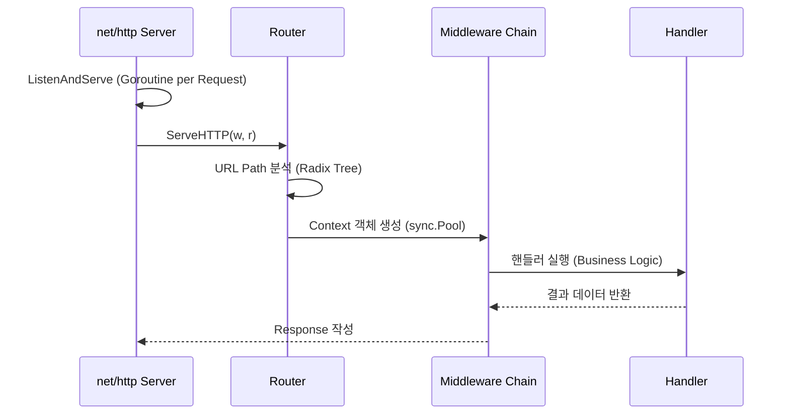
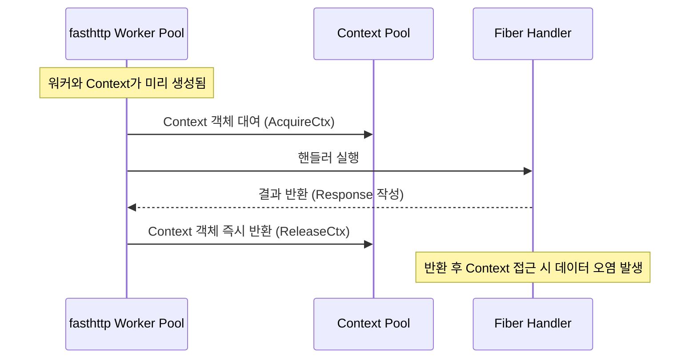

# Golang 웹 프레임워크 아키텍처 분석

Go 생태계에서 "표준 라이브러리(`net/http`)만으로 충분하다"는 주장은 언제나 매력적인 이상향으로 들립니다. 하지만 실제 비즈니스의 전장에서 마주하는 복잡한 요구사항과 촉박한 일정 속에서, 우리는 결국 바퀴를 다시 발명하기보다는 견고한 '도구'를 찾게 됩니다.

이 지점에서 개발자는 세 가지 갈림길에 섭니다. **압도적인 점유율로 사실상의 표준이 된 Gin**, **엔터프라이즈를 위한 정교한 구조미를 갖춘 Echo**, 그리고 **극한의 퍼포먼스를 위해 Node.js의 철학을 빌려온 Fiber**.

단순히 벤치마크 그래프의 화려한 막대 길이만 보고 결정하기엔, 그 뒤에 숨겨진 대가가 너무나 큽니다. **'Zero Allocation'이라는 달콤한 약속 뒤에는 메모리 경합(Race Condition)이라는 잠재적 위험이, 표준 준수라는 안정감 뒤에는 퍼포먼스의 타협이 숨겨져 있기 때문입니다.** 본 포스트에서는 표면적인 기능 비교를 넘어, **각 프레임워크가 선택한 아키텍처적 결단이 실제 운영 환경에서 어떤 파급 효과를 가져오는지** 심층적으로 파헤쳐 봅니다.

## 설계 철학

각 프레임워크는 서로 다른 우선순위를 가지고 설계되었습니다. **이러한 설계 사상은 단순한 코딩 스타일의 차이를 넘어, 미들웨어의 확장성과 생태계 호환성까지 결정짓는 핵심 요소입니다.**

### Gin: 실용주의적 고성능
Gin은 **초기 프레임워크인 Martini의 느린 속도(런타임 리플렉션 비용)를 해결하기 위해 등장했습니다.** `httprouter` 기반의 고성능 라우팅 엔진을 도입했으며, **"마법 없는(No Magic)" 명시적인 코드를 지향하여 디버깅 용이성을 극대화했습니다.** 81,000개 이상의 GitHub 스타가 증명하듯, **가장 성숙하고 방대한 서드파티 미들웨어 생태계를 보유하고 있다는 점이 최대 강점입니다.**

### Echo: 미니멀리즘과 구조적 확장성
Echo는 **"군더더기 없는(Unopinionated)" 설계를 지향하면서도 엔터프라이즈급 기능을 내장했습니다.** 표준 라이브러리와의 호환성을 유지하며, **특정 조건에서만 미들웨어를 실행하는 'Skipper' 패턴과 중앙 집중형 `HTTPError` 타입 지원을 통해 복잡한 비즈니스 로직을 깔끔하게 구조화할 수 있습니다.** 이는 개발자가 반복적인 코드 작성 없이 핵심 로직에만 집중할 수 있는 환경을 제공합니다.

### Fiber: Node.js 개발자를 위한 Express 스타일
Fiber는 **Node.js의 Express 프레임워크가 제공하는 직관적인 개발 경험(DX)을 Go 언어에 이식하여 진입 장벽을 낮추는 데 초점을 맞췄습니다.** 가장 큰 특징은 **Go 표준 `net/http` 대신 자체적인 `fasthttp` 엔진을 채택**했다는 점입니다. 이를 통해 **메모리 할당(Allocation)을 0에 가깝게 줄이고, 물리적 한계에 가까운 처리량(Throughput)을 구현했습니다.**

## 내부 동작 원리 및 아키텍처

프레임워크의 성능과 안정성은 **요청(Request) 처리의 생명주기와 기반이 되는 HTTP 엔진의 스레드 모델에 따라 결정됩니다.**

### 라우팅 메커니즘: Radix Tree 최적화
세 프레임워크 모두 Radix Tree(압축 트라이) 구조를 사용하지만 구현에는 미세한 차이가 있습니다.
*   **Gin**: HTTP 메서드별로 별도의 트리를 구성하며, **자주 접근하는 노드를 우선 순위화하여 검색 속도를 최적화했습니다.**
*   **Echo**: 비트 조작(Bit Manipulation)을 통한 메서드 조회 최적화와 **사전 계산된 파라미터 슬롯 할당으로 런타임 오버헤드를 줄였습니다.**
*   **Fiber**: **경로 파싱 시점에 정적 세그먼트와 타입 제약이 있는 파라미터를 미리 컴파일하여 런타임 연산을 최소화합니다.**

### 요청 처리 생명주기 비교

#### 표준 라이브러리 기반 (Gin, Echo)
Gin과 Echo는 **요청당 새로운 고루틴을 생성(`go c.serve()`)하는 `net/http` 모델을 따릅니다.**
**각 요청은 약 2KB~3KB의 스택 메모리와 독립적인 `http.Request` 객체를 할당받습니다.** 이 방식은 메모리 할당 비용이 발생하지만, 요청 간 격리성이 보장되어 **동시성 버그로부터 안전하며 HTTP/2 및 gRPC와 완벽하게 호환됩니다.**



#### Fiber의 워커 풀 모델 (fasthttp 기반)
Fiber는 **사전에 생성된 워커 풀(Worker Pool)과 `RequestCtx` 객체를 재사용하여 'Zero Allocation'을 달성합니다.**
**요청이 들어오면 기존에 생성된 객체를 초기화(`Reset`)하여 사용하므로 GC 부담이 거의 없습니다.** 하지만 이 구조는 **HTTP/2 멀티플렉싱을 지원하지 못하며, gRPC와 같은 최신 프로토콜 통합에 구조적인 한계를 가집니다.**



## 핵심 기술 비교 분석

### 실제 성능 벤치마크와 현실
벤치마크 수치는 인상적이지만, 실제 운영 환경에서의 차이는 미미할 수 있습니다.
*   **합성 벤치마크 (Synthetic)**: 단순 텍스트 반환 시 **Fiber는 초당 1,350만 요청(RPS)을 처리하며, Gin(700만)과 Echo(650만)를 압도합니다.**
*   **실제 워크로드 (Real-world)**: **DB 쿼리와 JSON 직렬화가 포함된 시나리오에서는 병목이 I/O로 이동하여, 세 프레임워크 모두 약 34,000~36,000 RPS 수준으로 성능이 수렴합니다.** 즉, **대부분의 비즈니스 로직에서 프레임워크 간 성능 차이는 5~6% 내외에 불과합니다.**

### 생태계 및 호환성
*   **DB 통합**: Gin과 Echo는 표준 `context.Context`를 사용하므로 **GORM, sqlx 등의 라이브러리와 매끄럽게 연동됩니다.** 반면 Fiber는 `adaptor`를 통해 변환 과정을 거쳐야 합니다.
*   **gRPC**: **Gin과 Echo는 `cmux` 등을 통해 gRPC와 HTTP를 동일 포트에서 서빙할 수 있지만, Fiber는 HTTP/2 미지원으로 인해 별도의 프록시 구성 없이는 gRPC 통합이 불가능합니다.**

### 테스트 용이성
*   **Gin/Echo**: 표준 `httptest` 패키지를 사용하여 **네트워크 바인딩 없이 핸들러를 단위 테스트할 수 있으며, `gock` 등의 모킹 라이브러리와 호환됩니다.**
*   **Fiber**: `app.Test()`를 제공하지만, **`net/http` 기반의 모킹 도구들을 사용할 수 없어 테스트 코드 작성 난이도가 높습니다.**

## 아키텍처적 주의사항 (Critical Caveats)

각 프레임워크 선택 시 반드시 고려해야 할 치명적인 리스크가 있습니다.

### Fiber: Context 생명주기와 데이터 경합
Fiber의 가장 큰 위험 요소는 **핸들러가 리턴되는 즉시 Context가 풀(Pool)로 반환된다는 점입니다.**
```go
func handler(c *fiber.Ctx) error {
    // 위험: 비동기 고루틴에서 c.Params 사용 시 Race Condition 발생
    go func() {
        fmt.Println(c.Params("id")) // 이미 다른 요청의 ID로 덮어쓰여졌을 수 있음
    }()
    return nil
}
```
**비동기 처리가 필요하다면 반드시 `c.Copy()`를 사용하거나 불변 설정을 켜야 하는데, 이는 Fiber의 장점인 성능 이점을 상쇄시킵니다.**

### Echo: 필드 변경 주의
Echo 인스턴스의 설정 필드는 서버 시작 후 변경해서는 안 됩니다. **런타임 중 Echo 객체의 설정을 변경하면 동시성 안전(Concurrency Safe)하지 않아 데이터 경합이 발생할 수 있습니다.**

### Gin: CPU 바운드 작업 차단
Gin 역시 단일 고루틴 풀을 공유하므로, **핸들러 내부에서 과도한 CPU 연산을 수행하면 이벤트 루프가 차단될 수 있습니다.** 무거운 작업은 반드시 별도의 워커 풀로 위임해야 합니다.

## 결론: 숫자가 아닌 맥락을 보는 시선

벤치마크 그래프의 드높은 막대는 언제나 매혹적이지만, 그것이 우리가 만드는 소프트웨어의 성공을 담보하지는 않습니다. 우리가 지금까지 살펴본 **Gin, Echo, Fiber는 단순한 도구의 차이를 넘어, '안전과 표준' 대 '극한의 효율'이라는 서로 다른 가치관의 대리전**이었습니다.

**Echo**는 엔터프라이즈 환경에서 요구하는 견고한 구조와 표준 준수의 가치를, **Gin**은 거대한 생태계가 주는 심리적 안정감과 실용성을, **Fiber**는 기존의 한계를 부수려는 도전적인 성능 중심의 철학을 대변합니다.

이제 당신이 내려야 할 결정은 "어떤 프레임워크가 더 빠른가?"가 아닙니다. **"우리 팀은 `fasthttp`의 메모리 관리 복잡성을 감당할 준비가 되었는가?", "우리의 서비스는 HTTP/2와 gRPC라는 미래 표준을 포기해도 될 만큼 현재의 속도가 절박한가?"** 라는 질문에 답하는 것입니다.

**진정한 성능 최적화는 프레임워크를 교체하는 것이 아니라, 비즈니스 로직의 병목을 이해하고 팀의 개발 생산성을 지켜내는 것에서 시작됩니다.** 부디 이 글이 당신의 팀에게 가장 적합한 '단 하나의 도구'를 찾아가는 여정에 명확한 나침반이 되었기를 바랍니다.