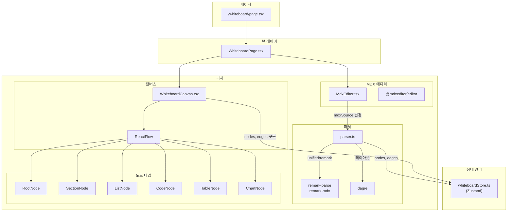
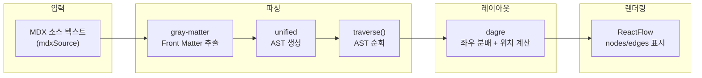
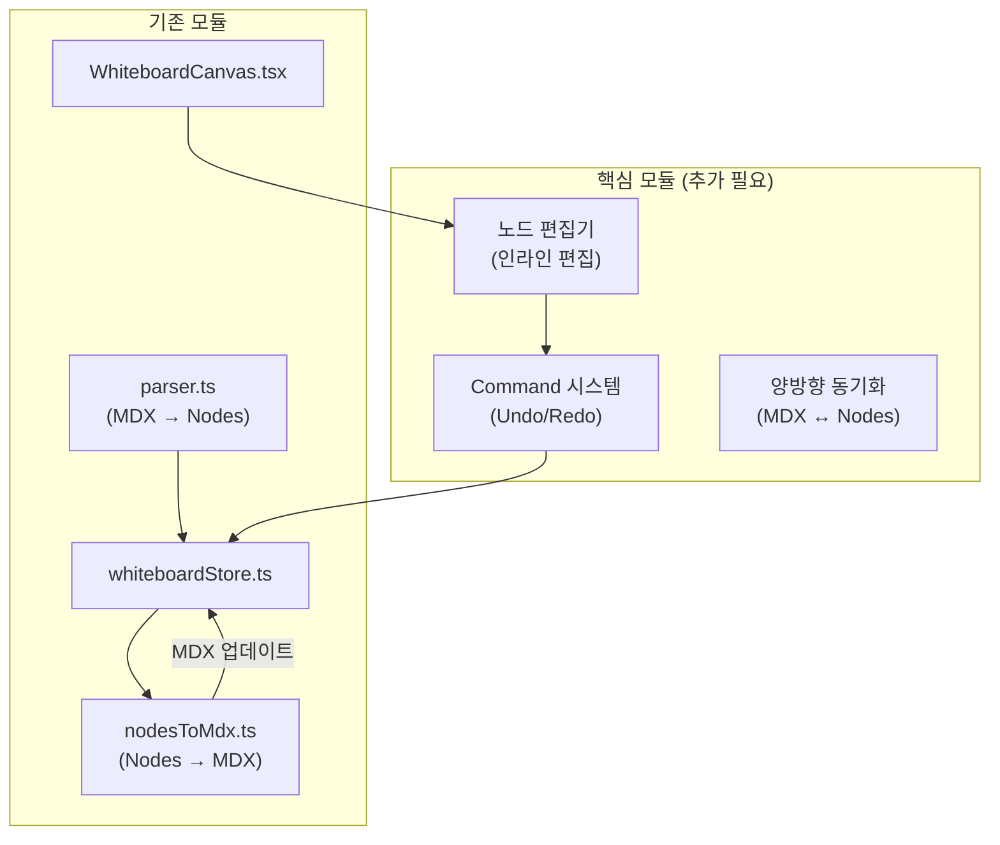

# Whiteboard 마인드맵 프로젝트 아키텍처 분석

MDX 기반 마인드맵/화이트보드 프로젝트의 현재 구조 분석 및 개선 방향 제안입니다.

---

## 기술 스택

| 카테고리 | 기술 | 버전 |
|---------|------|------|
| 프레임워크 | Next.js | 14.1.0 |
| UI | React + Tailwind CSS | ^18 |
| 마인드맵 렌더링 | ReactFlow | ^11.10.4 |
| 레이아웃 | Dagre | ^0.8.5 |
| MDX 파싱 | unified + remark-parse + remark-mdx | ^11 |
| 에디터 | @mdxeditor/editor | ^3.52.3 |
| 상태관리 | Zustand | ^5.0.9 |

---

## 현재 아키텍처 다이어그램



---

## 데이터 플로우



---

## 주요 파일 구조

```
src/
├── app/
│   └── whiteboard/
│       └── page.tsx                    # 화이트보드 페이지 진입점
│
├── views/
│   └── whiteboard/
│       └── ui/
│           └── WhiteboardPage.tsx      # 메인 뷰 컴포넌트
│
├── entities/
│   └── whiteboard/
│       └── model/
│           └── whiteboardStore.ts      # Zustand 상태 관리
│
└── features/
    └── mdx-whiteboard/
        ├── lib/
        │   └── parser.ts               # MDX → ReactFlow 변환
        │
        └── ui/
            ├── MdxEditor.tsx           # MDX 에디터 컴포넌트
            ├── WhiteboardCanvas.tsx    # ReactFlow 캔버스
            ├── PropertyEditor.tsx      # 속성 편집기
            │
            └── nodes/
                ├── index.ts            # 노드 타입 export
                ├── RootNode.tsx        # 루트 노드
                ├── SectionNode.tsx     # 섹션 (헤딩) 노드
                ├── ListNode.tsx        # 리스트 노드
                ├── CodeNode.tsx        # 코드 블록 노드
                ├── TableNode.tsx       # 테이블 노드
                ├── BlockquoteNode.tsx  # 인용문 노드
                ├── ComponentNode.tsx   # 일반 컴포넌트 노드
                └── components/
                    ├── chart/ChartNode.tsx
                    ├── math/MathNode.tsx
                    └── stats/StatsNode.tsx
```

---

## 핵심 모듈 분석

### 1. parser.ts - MDX 파서

**위치:** `src/features/mdx-whiteboard/lib/parser.ts`

**역할:**
- MDX 텍스트를 ReactFlow의 nodes/edges로 변환
- Front Matter 추출 (gray-matter)
- AST 생성 (unified + remark-parse + remark-mdx)
- 자동 레이아웃 적용 (dagre)

**주요 함수:**

```typescript
parseMdxToGraph(mdxContent: string, options?: { title?: string }): ParsedResult | null
```

**처리하는 노드 타입:**
| AST 타입 | ReactFlow 노드 타입 |
|----------|-------------------|
| heading | section |
| listItem | list |
| mdxJsxFlowElement | component / chart / math / stats |
| table | table |
| code | code |
| blockquote | blockquote |
| paragraph | list (시각적 스타일) |

**레이아웃 알고리즘:**
- 루트 자식 노드들을 좌/우로 균형 분배 (Greedy Balance)
- 각 측면에 Dagre 레이아웃 적용 (LR 방향)
- 수직 정렬로 중앙 정렬

---

### 2. whiteboardStore.ts - 상태 관리

**위치:** `src/entities/whiteboard/model/whiteboardStore.ts`

**관리하는 상태:**

```typescript
interface WhiteboardState {
    mdxSource: string;              // MDX 소스 텍스트
    nodes: Node[];                  // ReactFlow 노드 배열
    edges: Edge[];                  // ReactFlow 엣지 배열
    isEditorOpen: boolean;          // 에디터 패널 열림 상태
    editingNodeId: string | null;   // 현재 편집 중인 노드 ID
    reactFlowInstance: ReactFlowInstance | null;
    cursorIndex: number;            // MDX 에디터 커서 위치
    isComponentPickerOpen: boolean;
    fileHandle: any | null;         // File System Access API
    insertMarkdown: ((markdown: string) => void) | null;
}
```

---

### 3. WhiteboardCanvas.tsx - 캔버스

**위치:** `src/features/mdx-whiteboard/ui/WhiteboardCanvas.tsx`

**역할:**
- ReactFlow 인스턴스 렌더링
- 노드/엣지 변경 이벤트 처리
- 노드 타입 등록

**등록된 노드 타입:**
```typescript
const nodeTypes = {
    root: RootNode,
    section: SectionNode,
    list: ListNode,
    component: ComponentNode,
    table: TableNode,
    code: CodeNode,
    blockquote: BlockquoteNode,
    chart: ChartNode,
    math: MathNode,
    stats: StatsNode,
};
```

---

### 4. MdxEditor.tsx - MDX 에디터

**위치:** `src/features/mdx-whiteboard/ui/MdxEditor.tsx`

**역할:**
- @mdxeditor/editor를 사용한 WYSIWYG MDX 편집
- mdxSource 변경 시 자동으로 마인드맵 업데이트

**사용 플러그인:**
- headingsPlugin
- listsPlugin
- quotePlugin
- frontmatterPlugin
- jsxPlugin
- codeBlockPlugin
- codeMirrorPlugin
- tablePlugin
- linkPlugin
- imagePlugin

---

## 현재 구조의 문제점

### 1. 단방향 동기화만 지원

```
MDX 소스 → 마인드맵 (O)
마인드맵 → MDX 소스 (X)
```

노드를 드래그하거나 편집해도 MDX 소스에 반영되지 않음.

### 2. Undo/Redo 시스템 부재

`whiteboardStore.ts`에 히스토리 관리가 없음.
Command 패턴 기반의 실행 취소/다시 실행 기능 필요.

### 3. 노드 편집 기능 미완성

- `editingNodeId`가 있지만 실제 노드 내 텍스트 편집 로직 없음
- 노드 클릭 → 편집 모드 → 저장 → MDX 동기화 흐름 필요

### 4. 레이아웃 커스터마이징 제한

- Dagre에 의존하여 수동 레이아웃 조정 어려움
- 사용자가 노드 위치를 조정해도 재파싱 시 리셋됨

### 5. 접기/펼치기 미지원

- 대형 마인드맵에서 특정 브랜치를 접을 수 없음
- 상태 저장 메커니즘 없음

---

## obsidian-enhancing-mindmap과의 비교

| 항목 | 현재 프로젝트 | obsidian-enhancing-mindmap |
|------|--------------|---------------------------|
| **마크다운 파싱** | unified + remark | markmap-lib 번들 |
| **레이아웃** | Dagre (외부 라이브러리) | 자체 Layout 클래스 |
| **연결선** | ReactFlow smoothstep | SVG 베지어 곡선 (svg.js) |
| **양방향 동기화** | X (단방향만) | O (getMarkdown) |
| **Undo/Redo** | X | Command 패턴 + History 스택 |
| **노드 편집** | X | contentEditable + MarkdownRenderer |
| **접기/펼치기** | X | `^id` 마커로 상태 저장 |
| **내보내기** | X | PNG/JPEG/HTML |

---

## 개선 제안

### 1. 역변환 함수 추가 (노드 → MDX)

```typescript
// 제안: src/features/mdx-whiteboard/lib/nodesToMdx.ts

interface TreeNode {
    id: string;
    type: string;
    data: any;
    children: TreeNode[];
}

export function nodesToMdx(nodes: Node[], edges: Edge[]): string {
    // 1. 루트 노드 찾기
    const rootNode = nodes.find(n => n.type === 'root');
    if (!rootNode) return '';

    // 2. edges를 기반으로 트리 구조 재구성
    const tree = buildTree(rootNode, nodes, edges);

    // 3. DFS 순회하며 마크다운 생성
    return treeToMarkdown(tree, 0);
}

function buildTree(node: Node, nodes: Node[], edges: Edge[]): TreeNode {
    const childEdges = edges.filter(e => e.source === node.id);
    const children = childEdges
        .map(e => nodes.find(n => n.id === e.target))
        .filter(Boolean)
        .map(child => buildTree(child!, nodes, edges));

    return {
        id: node.id,
        type: node.type,
        data: node.data,
        children
    };
}

function treeToMarkdown(node: TreeNode, depth: number): string {
    let md = '';
    const indent = '\t'.repeat(Math.max(0, depth - 2));

    switch (node.type) {
        case 'root':
            // Front matter + title
            md += `---\ntitle: ${node.data.label}\n---\n\n`;
            break;
        case 'section':
            // 헤딩 레벨 (depth 기반)
            const level = Math.min(depth, 6);
            md += `${'#'.repeat(level)} ${node.data.label}\n\n`;
            break;
        case 'list':
            md += `${indent}- ${node.data.label}\n`;
            break;
        case 'code':
            const { lang, value } = node.data.codeData || {};
            md += `\`\`\`${lang || ''}\n${value || ''}\n\`\`\`\n\n`;
            break;
        case 'component':
            md += `<${node.data.label} />\n\n`;
            break;
        // ... 기타 타입 처리
    }

    // 자식 노드 재귀 처리
    node.children.forEach(child => {
        md += treeToMarkdown(child, depth + 1);
    });

    return md;
}
```

### 2. Command 패턴 도입

```typescript
// 제안: src/features/mdx-whiteboard/model/commands.ts

export abstract class Command {
    abstract execute(): void;
    abstract undo(): void;
    redo(): void { this.execute(); }
}

export class AddNodeCommand extends Command {
    constructor(
        private store: WhiteboardStore,
        private node: Node,
        private parentId: string
    ) { super(); }

    execute(): void {
        // 노드 추가 로직
    }

    undo(): void {
        // 노드 제거 로직
    }
}

export class DeleteNodeCommand extends Command { ... }
export class MoveNodeCommand extends Command { ... }
export class ChangeTextCommand extends Command { ... }

// History 관리
export class History {
    private undoStack: Command[] = [];
    private redoStack: Command[] = [];
    private limit = 50;

    execute(cmd: Command): void {
        cmd.execute();
        this.undoStack.push(cmd);
        this.redoStack = []; // 새 액션 시 redo 스택 클리어
        if (this.undoStack.length > this.limit) {
            this.undoStack.shift();
        }
    }

    undo(): void {
        const cmd = this.undoStack.pop();
        if (cmd) {
            cmd.undo();
            this.redoStack.push(cmd);
        }
    }

    redo(): void {
        const cmd = this.redoStack.pop();
        if (cmd) {
            cmd.redo();
            this.undoStack.push(cmd);
        }
    }
}
```

### 3. 노드 내 편집 기능

```tsx
// 개선된 SectionNode.tsx
export const SectionNode = memo(({ data, selected, id }: NodeProps) => {
    const [isEditing, setIsEditing] = useState(false);
    const [text, setText] = useState(data.label);
    const inputRef = useRef<HTMLTextAreaElement>(null);
    const { executeCommand } = useWhiteboardStore();

    const handleDoubleClick = () => {
        setIsEditing(true);
        setTimeout(() => inputRef.current?.focus(), 0);
    };

    const handleBlur = () => {
        setIsEditing(false);
        if (text !== data.label) {
            executeCommand(new ChangeTextCommand(id, data.label, text));
        }
    };

    const handleKeyDown = (e: React.KeyboardEvent) => {
        if (e.key === 'Enter' && !e.shiftKey) {
            e.preventDefault();
            inputRef.current?.blur();
        }
        if (e.key === 'Escape') {
            setText(data.label);
            setIsEditing(false);
        }
    };

    return (
        <div onDoubleClick={handleDoubleClick}>
            <Handle type="target" position={Position.Left} id="left" />

            {isEditing ? (
                <textarea
                    ref={inputRef}
                    value={text}
                    onChange={(e) => setText(e.target.value)}
                    onBlur={handleBlur}
                    onKeyDown={handleKeyDown}
                    className="w-full resize-none border-none outline-none bg-transparent"
                />
            ) : (
                <div className="font-bold text-sm">{data.label}</div>
            )}

            <Handle type="source" position={Position.Right} id="right" />
        </div>
    );
});
```

### 4. 접기/펼치기 상태 저장

마크다운에 `^id` 마커를 사용하여 접힌 상태 저장:

```markdown
## 접힌 섹션 ^section-collapsed
- 자식 1
- 자식 2
```

```typescript
// parser.ts 수정
const regexResult = /^.+ \^([a-z0-9\-]+)$/gim.exec(text);
const collapseId = regexResult?.[1];

const node = {
    id: collapseId || uuid(),
    data: {
        label: collapseId ? text.replace(` ^${collapseId}`, '') : text,
        collapsed: !!collapseId,  // 접힌 상태
    }
};
```

---

## 아키텍처 개선안



---

## 구현 우선순위

| 순위 | 기능 | 난이도 | 효과 |
|------|------|--------|------|
| 1 | **양방향 동기화** (nodesToMdx) | 중 | 높음 |
| 2 | **노드 인라인 편집** | 중 | 높음 |
| 3 | **Command 패턴** (Undo/Redo) | 중 | 중 |
| 4 | **접기/펼치기** | 낮 | 중 |
| 5 | **내보내기** (PNG/HTML) | 중 | 낮 |

---

## 참고 자료

- [obsidian-enhancing-mindmap 분석 문서](../../obsidian-enhancing-mindmap/docs/)
- [ReactFlow 공식 문서](https://reactflow.dev/)
- [Dagre 레이아웃](https://github.com/dagrejs/dagre)
- [unified 생태계](https://unifiedjs.com/)
